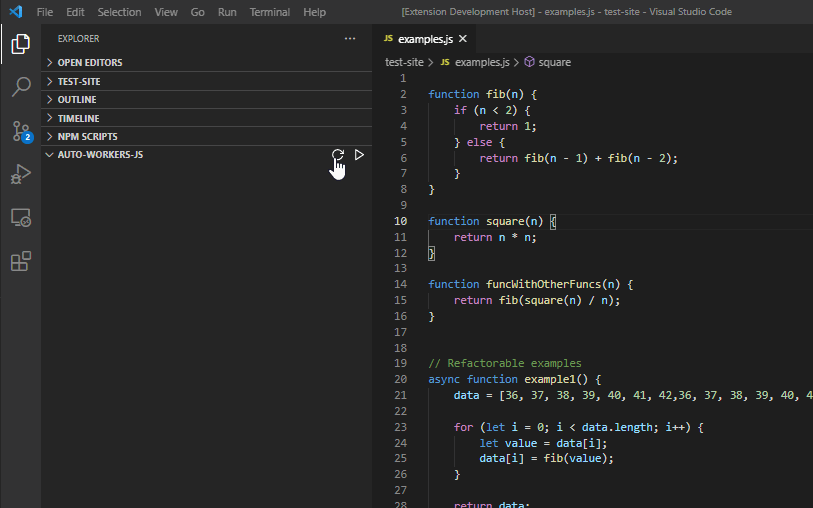

# AutoWorkersJS
An extension for refactoring JavaScript loops into parallel web workers.
Avalible to download on the VSCode marketplace here https://marketplace.visualstudio.com/items?itemName=AutoWorkersJS.autoworkersjs

### AutoWorkersJS
This directory holds the actual extension.
Simply open with VSCode, `node install` and then hit F5 to run the extension in debug mode.

### test-site
This directory holds some example code to use the tool with.
cd `test-site`, use `node testServer.js` and visit http://localhost:20582/.
Try running before and after refactoring the loops in examples.js to see the performance increase.
